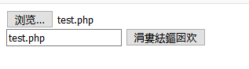
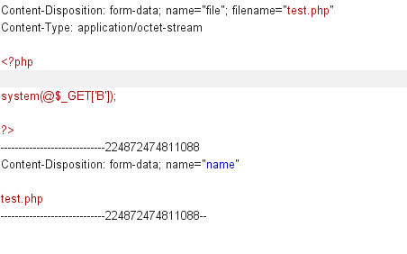
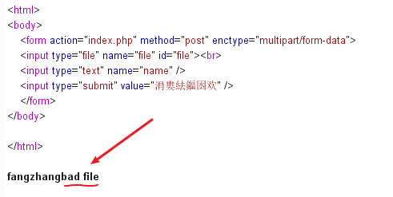
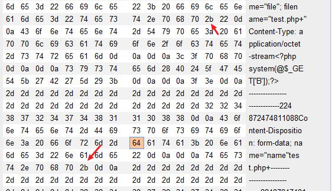
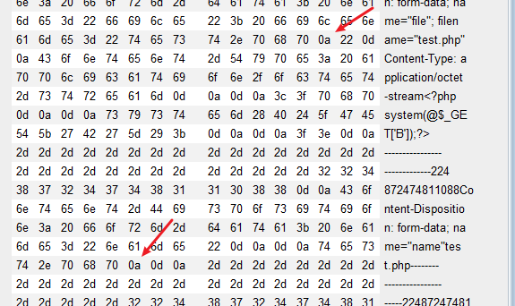
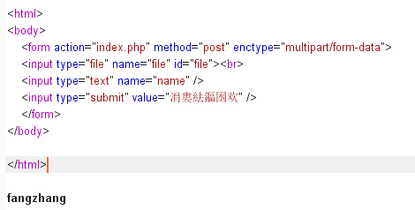
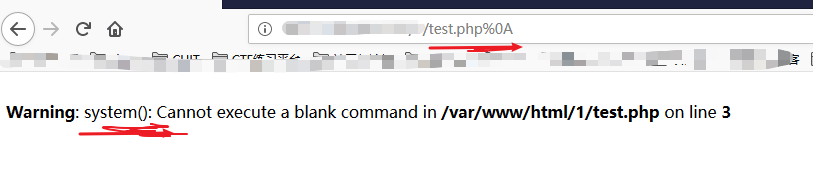
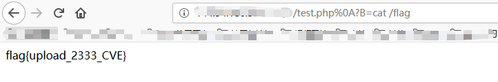

## CVE-2017-15715

### 原理

在Apache配置文件下，如果FileMatch使用以下形式

```apache
<FilesMatch \.php$>
```

在设置了 RegExp 对象的 Multiline 属性的条件下，$会匹配字符串结尾的'\n'。

同时在php上传文件采用黑名单，代码如下

```php
<?php
if(isset($_FILES['file'])) {
    $name = basename($_POST['name']);
    $ext = pathinfo($name,PATHINFO_EXTENSION);
    if(in_array($ext, ['php', 'php3', 'php4', 'php5', 'phtml', 'pht'])) {
        exit('bad file');
    }
    move_uploaded_file($_FILES['file']['tmp_name'], './' . $name);
}
```

那么我们就可以在上传时在php后缀后面加入一个换行符，就可以成功绕过黑名单，并且还会被Apache解析。

需要注意的是，如果代码是这样$_FILES\['file'\]\['name'\]获得文件名就绕不过，因为他会自动去掉换行符。

### 利用

先上传一个php文件看会怎样





返回一个bad file



先添加一个‘+’号，辨认位置



再改成换换行符



上传



上传成功，没有报错。

执行，看解析没



成功执行，获得flag

