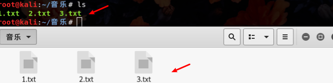
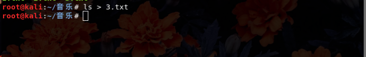
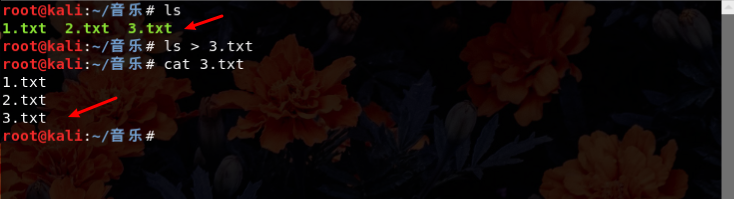
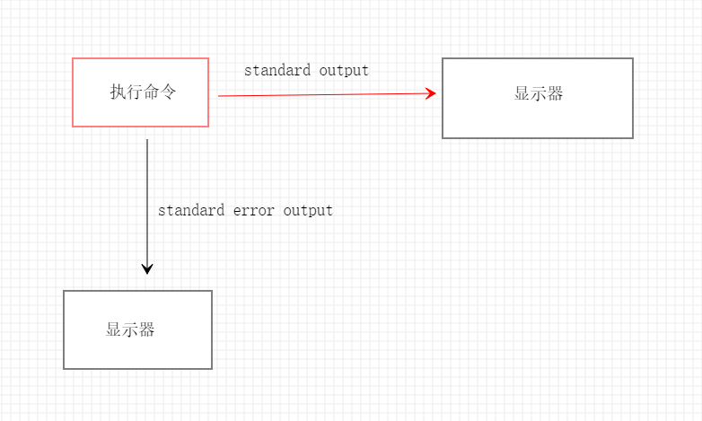
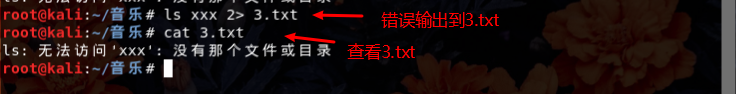
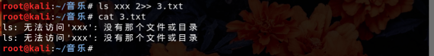
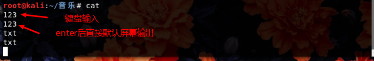
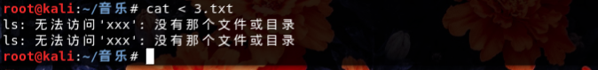
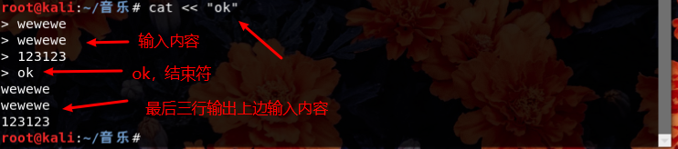

## linux反弹shell基础 >>> 数据流重定向

一直对这个shell情有独钟，linux下的反弹shell我一直没接触，一直没搞清楚这个反弹是什么，今天就来看看究竟什么是反弹。

---

### shell

- 什么是shell
  - 可以简单理解为：有一个中央枢纽，控制着整个系统的运行，而你是这个中央枢纽的主人，你想通过它来控制着整个系统的运行，但它不理解你的语言，所有你需要与它沟通的工具或者说能让它理解的语言，而这个中间人就是**shell**
  - 在linux中，中央枢纽可以是内核，而它的主人是这个系统的管理员用户（你），而shell可以对应命令行模式的shell
- shell的种类有很多：bash，csh，ksh..... 而我们主要要讲的是基于bash shell，为什么？因为它是绝大部分linux的默认使用shell

----

### 数据流重定向

- 什么是数据流重定向

  - 字面意思，貌似是把数据搞到别的地方。其实大概就是这样。**把原来数据默认输出输入的地方，根据自己喜好，指向了其他的地方。
  - 比如说：原本你通过某个命令将原本应该输出到屏幕上的数据，给输入到了别的地方。
- 详细操作

  - 在linux音乐目录下我有三个txt文件，我用**ls**命名来查看列出它们的存在，显示在屏幕上

    - 
    - 成功显示出三个txt文件在屏幕上

  - 我现在不想它输出在屏幕上，我想列出的文件输出到一个文件，比如3.txt

    - 输入命令：ls > 3.txt
      - 

    - 屏幕上什么也没显示，查看一下3.txt文件
      - 
      - 3.txt内容是ls列出的信息

  - 为什么这样，这就数据流重定向，把原本应该数出到屏幕上的数据，输出到文件里。
- **原理**

  - 学过linux的人都知道，linux下面一切皆文件，无论是软件还是硬件。
  - 在linux下，我们的显示器在linux下对应着一个文件，你输入命令的键盘也对应着一个文件
  - 当我们输入一条命令查看一个文件时，系统会做哪些东西
    - 
    - 当我们执行这个命名正确时，正确输出（standard output）信息，默认输出到屏幕上
    - 相反，当我们执行这个命名错误时，错误输出（standard error output）信息，默认输出到屏幕上
  - 除去上面两个输出，应该还有一个输入，standard input，全部整个表示

    - 标准输入（stdin）：代码为 0，是用 < 或 <<
    - 标准输出（stdout）：代码为 1，使用 > 或 >>
    - 标准错误输出（stderr）：代码为 2 ，使用 2> 或 2>>

  - 上面我们用到 **ls > 3.txt**，就是把ls正确输出信息输出到3.txt，**>**在这里起到重定向作用
  - 当我们去执行一个错误命令时，输出错误信息
    - 
    - 将错误信息输出到3.txt，命令：**ls xxx 2> 3.txt**
      - 
    - 如果使用命令是：**ls xxx 2>> 3.txt**
      - 
      - 两行错误信息
    - 细心的你一定发现了，当我们用 一个 **>** 时，会覆盖原本文件的内容，当我们用两个 **>>** 时，会在原本内容尾处添加
  - 竟然有输出到另一个文件，那自然也有把一个文件当做输入，代替键盘打
    - linux下cat命令有多个用法，如果在其后面不加任何东西，它就会把你在屏幕上输出的东西直接打印出来
      - 
    - 可以重定向文件内容，当做输入，再进行输出
      - 
    - 如果是用两个 **<<** ，那么其后面的东西就当做结束符。
      - 
  - 如果想要错误和正确的输出都到同一个文件，那该怎么办
    - 可能会这样 **ls > 3.txt 2> 3.txt**,很遗憾告诉你，这是不对的，因为两个数据同时写进一个文件，没有特殊的语法，会造成数据交叉，混乱，最终会生成，但内容是错乱了，最好不要使用。
    - 你可以这样 **ls > 3.txt 2>&1** 或  **ls &> 3.txt **两种格式完全相等。（字符之间不要有空格）
    - 这里的 **&** 有什么用？你可以简单理解为，如果没有它，那么上一行第一条命令的 1 系统会认为是文件，而加了之后，系统则判断为一个代码（上面有提到），是为了区别文件1还是代码1。

---

### 总结

- linux下的数据流重定向很有用，在写shell脚本时或理解linux系统时都很方便
- 重定向反应出linux下面一切皆文件的本质

---

参考文章或书籍

- 《鸟哥linux私房菜》

- <https://xz.aliyun.com/t/2548>